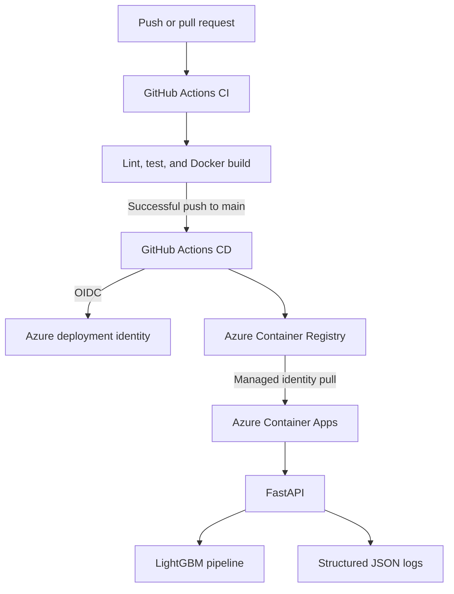

# Student Health Risk API

An end-to-end machine-learning deployment project that trains a LightGBM
classifier and serves health-condition predictions through FastAPI. The API is
packaged as a Docker image, tested with GitHub Actions, stored in Azure
Container Registry, and prepared for deployment to Azure Container Apps.

> This project is an educational demonstration. Its predictions are not
> medical advice and should not be used for clinical decisions.

## Architecture



The two Azure identities have separate responsibilities:

- The GitHub deployment identity pushes images and updates the Container App.
- The Container App pull identity reads images from the private registry.

No long-lived Azure password is stored in GitHub.

## Features

- Reproducible training entry point under `src/student_health/train.py`
- Scikit-learn pipeline with LightGBM native categorical features
- Saved preprocessing and model pipeline used unchanged during inference
- Single and batch prediction endpoints
- Pydantic request validation and generated OpenAPI documentation
- Non-root Docker runtime
- CI for linting, tests, and container builds
- OIDC-based continuous deployment with commit-SHA image tags
- Post-deployment health check
- Privacy-conscious structured prediction logs

## Model performance

The final LightGBM configuration was evaluated with three-fold out-of-fold
cross-validation. Balanced accuracy is the primary metric because the target
classes are imbalanced and ordinary accuracy would be dominated by the largest
class.

| Metric | Out-of-fold result |
|---|---:|
| Balanced accuracy | 0.9498 |
| Accuracy | 0.9388 |
| Macro F1 score | 0.8652 |

Recall was 0.9356 for `at-risk`, 0.9498 for `fit`, and 0.9640 for `unhealthy`.

The selected raw Optuna-tuned LightGBM submission was also evaluated on the
Kaggle competition leaderboard:

| Kaggle result | Score |
|---|---:|
| Public leaderboard | 0.94975 |
| Private leaderboard | 0.95011 |
| Final position | 760 of 3,355 teams (top 23%) |

The raw submission slightly outperformed the distribution-adjusted variant,
so it was retained as the final competition submission.

## Demo availability

The Azure-hosted API is intentionally kept offline rather than exposed as a
permanent public service. If you would like to try the live API, contact me and
I can arrange access or bring up a demonstration. You can also run the complete
API locally with Docker using the instructions below.

## Repository layout

```text
.
|-- .github/workflows/       CI and CD workflows
|-- artifacts/               Production model and label encoder
|-- notebooks/               Model experimentation
|-- src/student_health/      Training, inference, preprocessing, and API code
|-- tests/                   Unit tests
|-- Dockerfile               Production container definition
|-- pyproject.toml           Package metadata and tool configuration
`-- requirements.lock        Pinned runtime dependencies
```

The Kaggle source data is intentionally excluded from Git. Place downloaded
files in `data/` when retraining locally.

## Local setup

Python 3.10 or later is required.

```powershell
python -m venv .venv
.venv\Scripts\Activate.ps1
python -m pip install --upgrade pip
python -m pip install -r requirements.lock -e ".[dev]"
```

Run the checks:

```powershell
python -m ruff check src tests
python -m pytest
```

## Train the model

Place `train.csv` in `data/`, then run:

```powershell
student-health-train
```

The command writes:

```text
artifacts/lightgbm_pipeline.joblib
artifacts/label_encoder.joblib
```

The serialized pipeline contains preprocessing and the fitted model, preventing
training-serving skew during API inference.

## Run the API locally

```powershell
uvicorn student_health.api:app --reload --host 0.0.0.0 --port 8000
```

Useful URLs:

- API documentation: <http://localhost:8000/docs>
- Health check: <http://localhost:8000/health>
- Model metadata: <http://localhost:8000/model-info>

### Prediction example

```powershell
$Body = @{
    sleep_duration = 5.22
    heart_rate = 70.6
    bmi = 25.66
    calorie_expenditure = 2174.0
    step_count = 1326.0
    exercise_duration = 19.8
    water_intake = 1.86
    diet_type = "veg"
    stress_level = "high"
    sleep_quality = "average"
    physical_activity_level = "sedentary"
    smoking_alcohol = "yes"
    gender = "female"
} | ConvertTo-Json

Invoke-RestMethod `
    -Method Post `
    -Uri "http://localhost:8000/predict" `
    -ContentType "application/json" `
    -Body $Body
```

The response contains the predicted class and a probability for each class.
Batch requests with up to 100 records are available at `POST /predict/batch`.

## Docker

Build and run the production image:

```powershell
docker build --tag student-health-api:local .
docker run --rm --publish 8000:8000 student-health-api:local
```

The container installs pinned dependencies, includes only the production model
artifacts, runs as an unprivileged user, and listens on port `8000`.

## CI/CD

`CI` runs for pull requests and pushes to `main`:

1. Install dependencies.
2. Lint production and test code.
3. Run the test suite.
4. Verify that the Docker image builds.

After CI succeeds on `main`, `CD`:

1. Checks out the exact commit that passed CI.
2. Authenticates to Azure through GitHub OIDC.
3. Builds and pushes an image tagged with the Git commit SHA.
4. Updates the existing Azure Container App, creating a revision.
5. Calls `/health` until the deployment becomes ready or times out.

The repository requires these GitHub Actions secrets:

```text
AZURE_CLIENT_ID
AZURE_TENANT_ID
AZURE_SUBSCRIPTION_ID
```

It also uses these repository variables:

```text
AZURE_RESOURCE_GROUP
AZURE_CONTAINER_APP_NAME
ACR_NAME
ACR_LOGIN_SERVER
IMAGE_NAME
```

## Structured logging

Prediction endpoints write one JSON event to standard output for every request.
Azure Container Apps collects standard output, making these events available in
the log stream. A successful event resembles:

```json
{
  "duration_ms": 8.41,
  "endpoint": "/predict/batch",
  "event": "prediction_completed",
  "prediction_counts": {
    "at-risk": 1,
    "fit": 2
  },
  "record_count": 3,
  "request_id": "c696cf33-df04-46e0-8913-e1fb9ce13a6d",
  "timestamp": "2026-08-26T12:00:00+00:00"
}
```

Logs deliberately exclude raw feature values, probability vectors, and error
messages. This provides operational signals while reducing exposure of
health-related input data.

## API endpoints

| Method | Endpoint | Purpose |
|---|---|---|
| `GET` | `/health` | Deployment health check |
| `GET` | `/model-info` | Model type, classes, and feature schema |
| `POST` | `/predict` | Predict one record |
| `POST` | `/predict/batch` | Predict 1-100 records |

## Limitations

- The model reflects the supplied competition dataset and its biases.
- If deployed publicly, the demonstration API has no user authentication or
  rate limiting.
- Model retraining is currently a deliberate local operation, not an automated
  production training pipeline.
- Production use would require stronger privacy controls, monitoring, model
  validation, drift detection, and domain-expert review.
